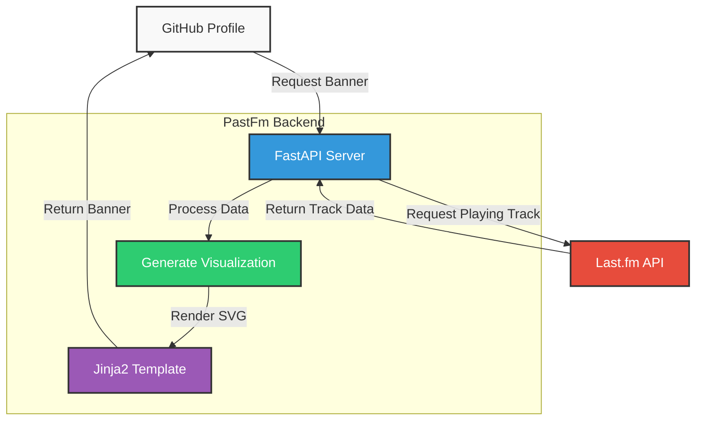

# PastFm

<div align="center">
  
  <p><i>Last.fm Scrobble Card for GitHub Profile READMEs</i></p>
</div>

<p align="center">
  <a href="#why-pastfm">Why PastFm</a> •
  <a href="#features">Features</a> •
  <a href="#usage">Usage</a> •
  <a href="#architecture">Architecture</a> •
  <a href="#local-development">Local Development</a> •
  <a href="#deployment">Deployment</a> •
  <a href="#contributing">Contributing</a> •
  <a href="#license">License</a>
</p>

## Why PastFm

I had been using the [spotify-github-profile](https://github.com/kittinan/spotify-github-profile) banner for a long time. But ever since Spotify restricted modded apps, I found myself using multiple music platforms. PastFm solves this by connecting to Last.fm which aggregates my listening activity across platforms!

Big thanks to [kittinan](https://github.com/kittinan) whose design inspired PastFm's card theme.

## Features

- 🎵 **Cross-platform support**: Works with any music service that scrobbles to Last.fm
- 🎨 **Customizable**: Change colors and username parameters
- 🔄 **Live updates**: Shows currently playing or recently played tracks
- 🖼️ **Album artwork**: Displays album cover art when available
- 🚀 **Fast rendering**: Optimized SVG generation with minimal dependencies

## Usage

1. **Sign up for Last.fm** and connect your music platforms (Spotify, Apple Music, YouTube Music, etc.)
2. **Add the banner** to your GitHub profile README:

   ```markdown
   
   ```

3. **Customize** (optional):
   - Change the color: `&color=f70000` (hex color without #)
   - Example with custom color: 
     ```markdown
     
     ```

## Architecture

PastFm is built with a simple but effective architecture that enables real-time music status display from Last.fm on GitHub profiles.

### Application Flow



### Component Overview

1. **API Layer (`app/api.py`)**: 
   - FastAPI routes handle requests for the Now Playing card
   - Endpoints support customization (username, color)
   - Cache control ensures up-to-date display

2. **Last.fm Client (`utils/lastfm.py`)**: 
   - Makes API calls to Last.fm to retrieve scrobble data
   - Handles track metadata and image processing
   - Error handling for API failures

3. **Visualization Engine (`utils/visualization.py`)**: 
   - Generates CSS animations for audio visualization bars
   - Creates dynamic visual elements

4. **Template Renderer (`templates/default_theme.html`)**: 
   - Jinja2 template for SVG image generation
   - Responsive design with customizable styling

5. **Configuration (`config.py`)**:
   - Centralized settings with environment variable support
   - Default parameters for customization

## Local Development

1. **Clone the repository**:
   ```bash
   git clone https://github.com/arpy8/PastFm.git
   cd PastFm
   ```

2. **Set up a virtual environment**:
   ```bash
   python -m venv .venv
   source .venv/bin/activate  # On Windows: .venv\Scripts\activate
   ```

3. **Install dependencies**:
   ```bash
   pip install -r requirements.txt
   ```

4. **Configure environment variables**:
   - Copy `.env.example` to `.env`
   - Add your Last.fm API key (get one from [Last.fm API](https://www.last.fm/api/account/create))

5. **Add a placeholder image**:
   - Create a `temp.gif` file in the `static/` directory for fallback album art

6. **Run the application**:
   ```bash
   python main.py
   ```

7. **Test the application**:
   - Open `http://localhost:7860/live?user=YOUR_LASTFM_USERNAME` in your browser

## Deployment

PastFm is designed to be deployed easily to platforms like Hugging Face Spaces or similar services:

1. **Using Docker**:
   ```bash
   docker build -t pastfm .
   docker run -p 7860:7860 -e LASTFM_API_KEY=YOUR_KEY pastfm
   ```

2. **On Hugging Face Spaces**:
   - Create a new Space with Docker template
   - Add your Last.fm API key as a secret
   - Push the code to the Space repository

## Contributing

Contributions are welcome! Please feel free to submit a Pull Request.

1. Fork the repository
2. Create your feature branch (`git checkout -b feature/amazing-feature`)
3. Commit your changes (`git commit -m 'Add some amazing feature'`)
4. Push to the branch (`git push origin feature/amazing-feature`)
5. Open a Pull Request

## License

Distributed under the MIT License. See `LICENSE` for more information.

---

Created by [arpy8](https://github.com/arpy8) | [Report Bug](https://github.com/arpy8/PastFm/issues)
